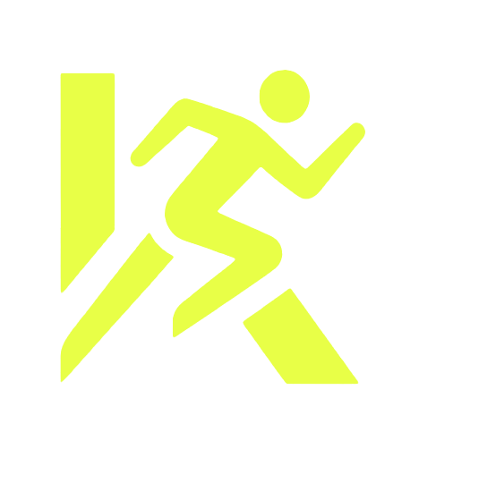

<div align="center">
  
  <h1>KavaFit</h1>
  <p><strong>Evrimini Sen Yönet! Sınırlarını Zorla!</strong></p>
  <p>Sporcuların antrenman ve gelişim takibini profesyonel bir seviyeye taşıyan, oyunlaştırılmış ve yapay zeka destekli modern bir web uygulaması.</p>
</div>

<br />

## 🌟 Proje Vizyonu
**KavaFit**, standart bir spor takip uygulamasının ötesine geçerek kullanıcılara kişiselleştirilmiş bir deneyim sunmayı amaçlar. Modern tasarımı ve akıllı özellikleriyle sporcuların **hedeflerine ulaşmasını kolaylaştırır, anlık motivasyonlarını artırır** ve her setin, her tekrarın, her öğünün hesabını tutarak gerçek bir gelişim haritası çizer. 

Kava ile disiplini rutine, eforu ise ölçülebilir başarılara dönüştürüyoruz.

---

## 🔥 Öne Çıkan Özellikler

- **🏋️ Gelişmiş Antrenman Takibi:** 
  - Günlük antrenman programları oluşturma (Şablonlar, Bugün menüsü).
  - Vücut bölgelerine göre egzersiz filtreleme ve ağırlık/set/tekrar kayıtları girme.
  - **PR (Personal Record) Algılama:** Eski verilere göre kendi rekorunu kırdığında anında bildirim alma.
- **🎮 Oyunlaştırma: XP ve Rozet Sistemi:**
  - Kullanıcılar antrenman yaptıkça, kalori hedeflerini (%75 ve %100) tamamladıkça veya rekorlar kırdıkça XP kazanır.
  - "Yeni Başlayan" seviyesinden "Ölümsüz" seviyesine uzanan 8 kademeli seviye sistemi.
  - 3-7-30 günlük seriler, PR kırma, ağırlık hedefleri (Ejderha rozeti vb.) gibi özel başarımlar ve pop-up bildirimler.
- **🤖 Yapay Zeka Destekli Koç (AiCoach):**
  - Antrenman sorularına cevap verebilen günlük hak sistemine (Günlük 10 hak) sahip yapay zeka asistanı.
  - XP kazandıkça açılan **Persona Kilitleri** (Felsefi Koç, Drill Sergeant, Analitik Koç).
- **🍎 Kapsamlı Beslenme ve Makro Takibi:**
  - Kalori, protein, yağ, karbonhidrat hedeflerini belirleme.
  - Favori gıdalar ekleme (FoodRecognize / AI tabanlı gıda tanıma altyapısı).
- **📊 Grafik ve Gelişim Raporları:**
  - `chart.js` gücüyle sağlanan interaktif grafikler sayesinde haftalık ve günlük gelişim analizi.
  - Su tüketimi loglaması ve vücut ölçümleri (`body`) veri tutma.

---

## 🏗️ Mimari & Kullanılan Teknolojiler

Proje modern **React Web (Vite)** mimarisi üzerine kurulu olup Mobile First - PWA(Progressive Web App) vizyonuyla kodlanmıştır.

- **Frontend & Derleyici:**
  - `react` (^18.3.1), `react-dom`
  - `vite` (hızlı derleme ve HMR)
  - Dinamik yönlendirme için `react-router-dom`
- **Veritabanı ve Kimlik Doğrulama:**
  - `firebase` (^10.12.2) (Firestore & Authentication)
- **State Management (Durum Yönetimi):**
  - Proje, veri akışını merkezi ve etkili şekilde yürütebilmek adına güçlü bir **`useAppContext`** kurgusuna sahiptir.
  - Profil, egzersiz kayıtları (History/Archive), yapay zeka hak sınırları, makro limitleri ve XP/Rozet gibi veriler hem `LocalStorage` ile performansa odaklar hem de asenkron `Firebase/Firestore` pull/push işlemleri ile yedeklenir.
- **Grafik ve İstatistik:**
  - `chart.js` ve `react-chartjs-2`

---

## 📂 Klasör Yapısı

```bash
KavaGym/fittrack/
├── public/                 # Statik dosyalar (logo.png vb.)
├── src/
│   ├── components/         # Uygulamanın modüler yapı taşları
│   │   ├── pages/          # Uygulamanın tüm sayfaları (Ana ekranlar: Home, Exercises, Calories vb.)
│   │   ├── ui/             # Yeniden kullanılabilir küçük UI elemanları (Toast modalı vb.)
│   │   ├── AuthScreen.jsx  # Giriş / Kayıt ekranı
│   │   ├── BottomNav.jsx   # Uygulamanın ana mobil tarz navigasyonu
│   │   └── Header.jsx      # Üst bilgi çubuğu
│   ├── context/
│   │   └── AppContext.jsx  # Global State ve Firebase Database işlemleri (CRUD)
│   ├── styles/             # Global CSS dosyaları, değişkenler ve animasyonlar
│   ├── App.jsx             # Ana yönlendirme şablonu ve Theme/Layout mantığı
│   ├── firebase.js         # Firebase config dosyası
│   └── main.jsx            # React giriş noktası ve DOM render'ı
├── .gitignore
├── package.json            # Proje bağımlılıkları ve komut dosyaları
└── vite.config.js          # Vite derleyici ayarları
```

---

## 🚀 Kurulum ve Çalıştırma

Projeyi yerel ortamınızda sıfırdan ayağa kaldırmak için aşağıdaki adımları sırasıyla terminal üzerinde uygulayın:

1. **Projeyi Kopyalayın:**
   ```bash
   git clone <repo-url>
   cd fittrack
   ```

2. **Bağımlılıkları Yükleyin:**
   ```bash
   npm install
   ```

3. **Firebase Bağlantısı:**
   (Not: Root dizinde veya `src/firebase.js` içerisinde çalışır durumda bir Firebase config'inin ve ortam değişkenlerinin olduğuna emin olun.)

4. **Projeyi Başlatın:**
   ```bash
   npm run dev
   ```
   *Proje `localhost` üzerinde ayağa kalkacak, mobil görünümünde test etmek için tarayıcı üzerinden mobil simülasyonunu kullanabilirsiniz.*

5. **Production Build (Opsiyonel):**
   ```bash
   npm run build
   ```

---

## 🗺️ Gelecek Planları / Roadmap

- [ ] **Sosyal Medya Entegrasyonu:** Kullanıcıların kazandığı PR ve rozetleri Instagram/Twitter üzerinde anlık paylaşımı.
- [ ] **Giyilebilir Teknoloji Desteği:** Apple Health ve Google Fit entegrasyonu ile adım sayar / kalori çekme yeteneği.
- [ ] **Karanlık Mod/Aydınlık Mod Geliştirmeleri:** Temaların özelleştirilebilir logolar ve vurgu renkleriyle genişletilmesi.
- [ ] **Topluluk ve Liderler Tablosu (Leaderboard):** Kullanıcıların seviyelerine (Örn: Ölümsüzler, Şampiyonlar) göre bulundukları ligi görebilecekleri sayfa tasarımı.
- [ ] **Daha Gelişmiş Beslenme Algoritmaları:** Market barkod okuma ile otomatik besin girişi sistemi entegrasyonu.

---

> *"Antrenman bir varış noktası değil, bir yaşam tarzıdır."* — **KavaFit Takımı**
